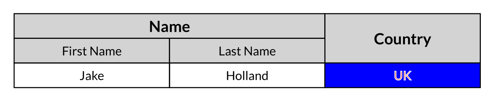

[](https://www.npmjs.com/package/@hollandjake/pdfkit-table)
[ ](https://github.com/hollandjake/pdfkit-table/blob/main/README.md)
[](https://github.com/hollandjake/pdfkit-table/blob/main/LICENSE)

# pdfkit-table

> Generate pdf tables with javascript (PDFKIT plugin)

## Examples

[example pdf](https://github.com/hollandjake/pdfkit-table/raw/main/examples/basic-example.pdf)
[example code](https://github.com/hollandjake/pdfkit-table/raw/main/examples/basic-example.js)



## Installation

[](https://www.npmjs.com/package/@hollandjake/pdfkit-table)

```sh
npm install @hollandjake/pdfkit-table
```

### Import into your script

```ts
const PDFDocument = require('@hollandjake/pdfkit-table');
```

or

```ts
import PDFDocument from '@hollandjake/pdfkit-table';
```

## Usage

```ts
import PDFDocument from 'pdfkit';

const PDFDocument = require('@hollandjake/pdfkit-table');

// init document
let doc = new PDFDocument();
// save document
doc.pipe(fs.createWriteStream('./document.pdf'));

// create a table
doc
  .table()
  .row(['Country', 'Conversion rate', 'Trend'])
  .row(['Switzerland', '12%', '+1.12%'])
  .row(['France', '67%', '-0.98%'])
  .row(['England', '33%', '+4.44%']);

// done!
doc.end();
```

## Configuration

The table and the cells are configurable to enable full customisation

### Table

| Property    | Type                       | Default     | Description                                                                                                                                                                 |
| ----------- | -------------------------- | ----------- | --------------------------------------------------------------------------------------------------------------------------------------------------------------------------- |
| cols        | `number`                   | `undefined` | Number of columns you wish to divide the table into, allowing the width of a cell to be calculated                                                                          |
| rows        | `number`                   | `undefined` | Number of rows you wish to divide the table into, allowing the height of a cell to be calculated                                                                            |
| cellHeight  | `Size`                     | `2em`       | Height of a cell <br> If not provided it will compute it based on height / rows <br> If neither rows nor cellHeight is provided, the default of 2em is used                 |
| cellWidth   | `Size`                     | `25%`       | Width of a cell <br> If not provided it will compute it based on width / cols <br> If neither cols nor cellWidth is provided, the default of 25% of the table width is used |
| x           | `Size`                     | `undefined` | Position of the table, default to `document.x`                                                                                                                              |
| y           | `Size`                     | `undefined` | Position of the table, default to `document.y`                                                                                                                              |
| width       | `Size`                     | `undefined` | The width of the table, `undefined` for page width                                                                                                                          |
| height      | `Size`                     | `undefined` | The height of the table                                                                                                                                                     |
| border      | `SideDefinition<Wideness>` | `0`         | The thickness of the tables border <br> Default is 0, so no table border (as the cells render it)                                                                           |
| borderColor | `SideDefinition<PDFColor>` | `undefined` | The border color of the table                                                                                                                                               |
| defaultCell | `Cell`                     | `undefined` | Any config you wish to apply to all cells                                                                                                                                   |

### Cell

| Property        | Type                                                                                                | Default                               | Description                                                                      |
| --------------- | --------------------------------------------------------------------------------------------------- | ------------------------------------- | -------------------------------------------------------------------------------- |
| value           | `any`                                                                                               | `undefined`                           | The value to render in the cell, booleans are converted to ✓ (tick) or ✕ (cross) |
| colspan         | `number`                                                                                            | `1`                                   | How many columns this cell covers, follows the same logic as HTML `colspan`      |
| rowspan         | `number`                                                                                            | `1`                                   | How many rows this cell covers, follows the same logic as HTML `rowspan`         |
| padding         | `SideDefinition<Wideness>`                                                                          | `0.25em`                              | The padding for the cell                                                         |
| border          | `SideDefinition<Wideness>`                                                                          | `1pt`                                 | The border for the cell                                                          |
| borderColor     | `SideDefinition<PDFColor>`                                                                          | `undefined`                           | The border colors for the cell                                                   |
| backgroundColor | `PDFColor`                                                                                          | `undefined`                           | The color for the cell                                                           |
| textColor       | `PDFColor`                                                                                          | Value of the PDFs current fillColor   | The color of the text                                                            |
| textStroke      | `Wideness`                                                                                          | `0`                                   | The text stroke                                                                  |
| textStrokeColor | `PDFColor`                                                                                          | `undefined`                           | The text stroke color                                                            |
| align           | `'center' \| {x?: 'left'   \| 'center' \| 'right' \| 'justify', y?: 'top' \| 'center' \| 'bottom'}` | `{ x: 'left', y: 'center' }`          | The alignment of the text                                                        |
| font            | `string`                                                                                            | Value of the PDFs current font        | The font of the text                                                             |
| fontFamily      | `string`                                                                                            | Value of the PDFs current font family | The font family of the text                                                      |
| fontSize        | `Size`                                                                                              | Value of the PDFs current font size   | The font size of the text                                                        |
| x               | `Size`                                                                                              | `undefined`                           | Override the positioning of the cells x position                                 |
| y               | `Size`                                                                                              | `undefined`                           | Override the positioning of the cells y position                                 |
| debug           | `boolean`                                                                                           | `false`                               | Render the debug lines of the cell                                               |

## Homepage

You can find more about this on [GitHub](https://github.com/hollandjake/pdfkit-table).

## Contributing

Contributions, issues and feature requests are welcome!

Feel free to check [issues page](https://github.com/hollandjake/pdfkit-table/issues).

## Credits

Thanks to [PDFKit](https://github.com/foliojs/pdfkit) for the inspiration

## Authors

- **[Jake Holland](https://github.com/hollandjake)**

See also the list of [contributors](https://github.com/hollandjake/pdfkit-table/contributors) who participated in this
project.

## License

This project is [MIT](https://github.com/hollandjake/pdfkit-table/blob/main/LICENSE) licensed.
